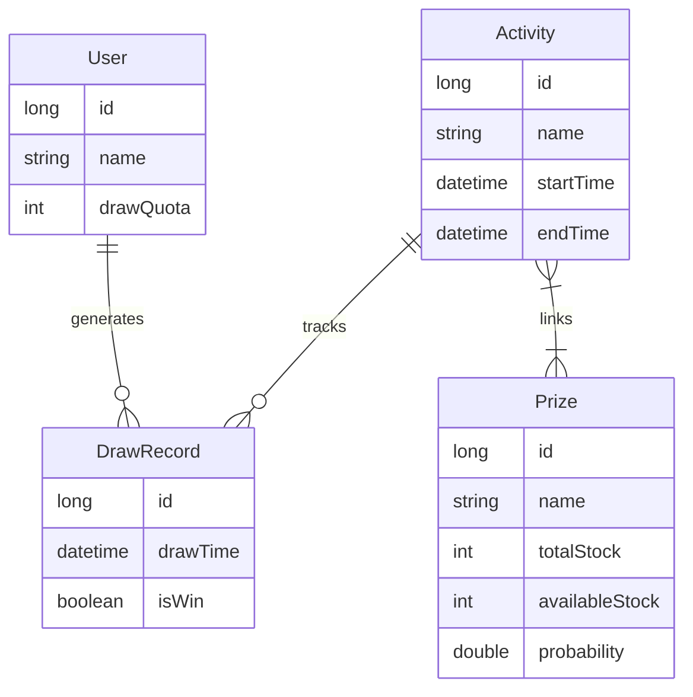
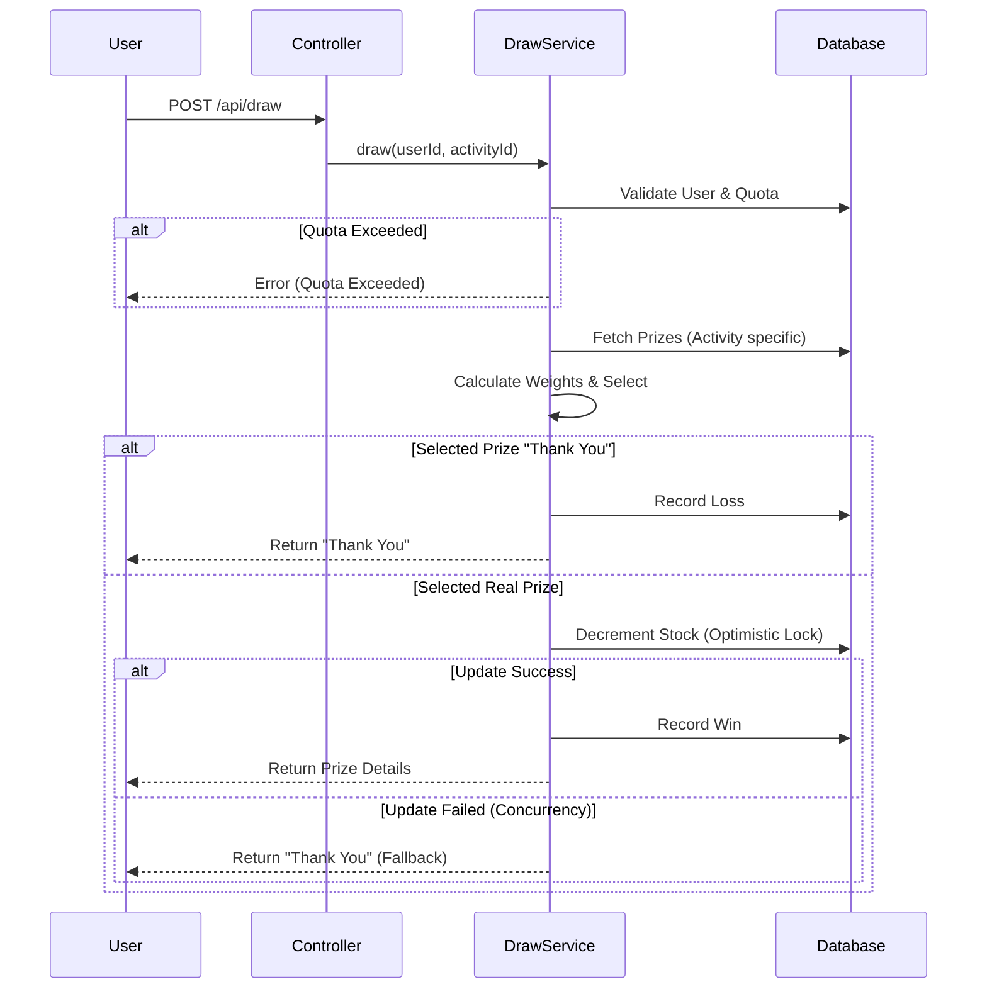

# Lucky Draw System

A high-concurrency "Wheel of Fortune" style lucky draw system built with Java 21 and Spring Boot 3.3.0.

## A. 功能 (Features)

### 1. 獎品設定
- **多種獎品管理**：支援動態配置獎品名稱、庫存與中獎機率。
- **機率總和控制**：「銘謝惠顧」（Thank You Prize）作為預設無獎選項，系統自動計算其機率，確保所有獎品機率總和為 100%。
- **動態配置**：提供 RESTful API 讓管理員即時新增、修改或刪除獎品設定。

### 2. 抽獎模式
- **彈性抽獎**：支援單次抽獎 API。
- **次數限制**：每個抽獎活動可設定每位使用者的最大抽獎次數（`maxDrawsPerUser`）。

### 3. 風控機制
- **用戶限流**：嚴格檢核使用者是否超出活動允許的抽獎次數。
- **庫存保護**：防止超賣（Over-selling）。使用樂觀鎖（Optimistic Locking）確保獎品庫存不會被多扣，當庫存不足時自動降級為「銘謝惠顧」。

---

## B. 架構 (Architecture)

### 1. 分散式架構
- **Spring Boot 3.3.0**：採用現代化框架，支援微服務擴展。
- **Stateless Design**：RESTful API 設計，無狀態特性易於水平擴充（Horizontal Scaling）。
- **Dockerized**：提供 Dockerfile 與 Multi-stage build，支援容器化部署（Kubernetes / Cloud Run / Render）。

### 2. 高併發事務一致性
- **資料庫鎖定**：使用 Database Optimistic Lock (`@Version` / `available_stock > 0` check) 確保高併發下的扣庫存原子性。
- **Redis 緩存 (Optional)**：已整合 Redis 依賴，可用於快取獎品資訊或實作分散式鎖（Distributed Lock）。

### 3. 多環境部署 support
- **配置分離**：`application.yml` 參數化設計（Profiles: dev, prod）。
- **環境變數注入**：支援透過 Environment Variables（如 `SPRING_DATA_REDIS_HOST`）動態切換資料庫與 Redis 連線設定。

---

## C. 設計 (Design)

### 1. API 設計
- **RESTful Style**：資源導向的 URI 設計（e.g., `POST /api/draw`, `GET /api/users`）。
- **Swagger/OpenAPI**：整合 Springdoc，提供互動式 API 文件與完整的參數說明。

### 2. 身份驗證與權限分級
**Header**: `Authorization: Bearer <token>`

| Role  | Token Value | Access Scope |
| :--- | :--- | :--- |
| **Admin** | `admin-secret` | 完整權限（新增活動、管理獎品、**新增使用者**） |
| **User** | `<any-other-token>` | 僅限讀取用戶資料與執行抽獎 |

> [!IMPORTANT]
> **User Creation** API (`POST /api/users`) 受 Admin 權限保護。

### 3. 錯誤處理與驗證
- **Global Exception Handler**：統一處理業務異常（如 `BizException`）與系統異常，回傳標準化 JSON 錯誤結構。
- **Input Validation**：使用 JSR-380 (`@Valid`, `@NotNull`, `@DecimalMax`) 嚴格驗證輸入參數（如機率不可負、總和不可超過 1）。

### 4. API 文件
Access Swagger UI at `http://localhost:8080/swagger-ui.html`.

### 5. Table Schema (ER Model)


---

## D. 測試 (Testing)

### 1. 單元測試 (Unit Tests)
撰寫完整的 JUnit 5 測試案例，覆蓋：
- **機率分佈**：驗證加權隨機演算法的準確性 (`WeightedRandomDrawStrategyTest`)。
- **邊界條件**：測試庫存為 0、機率為 0 或 100% 的極端情況。
- **併發測試**：模擬多執行緒同時抽獎，驗證庫存扣減的正確性 (`DrawConcurrencyTest`)。
- **Service Layer**：覆蓋 `AdminService`, `DrawService`, `UserService` 的核心邏輯。

---

### 2. API 測試流程 (API Testing Flow)
建議依照以下順序進行 API 手動測試：

#### Step 1: Admin - 創建獎品 (Create Prize)
- **Endpoint**: `POST /api/admin/prizes`
- **Header**: `Authorization: Bearer admin-secret`
- **Body**:
```json
{
  "name": "iPhone 15",
  "totalStock": 10,
  "probability": 0.01
}
```
*(記下回傳的 `id`，例如 1)*

#### Step 2: Admin - 創建活動 (Create Activity)
- **Endpoint**: `POST /api/admin/activities`
- **Header**: `Authorization: Bearer admin-secret`
- **Body**:
```json
{
  "name": "Weekend Lucky Draw",
  "startTime": "2024-06-01T10:00:00+08:00",
  "endTime": "2024-06-01T12:00:00+08:00",
  "maxDrawsPerUser": 5,
  "prizeIds": [1] 
}
```

#### Step 3: Admin - 創建使用者 (Create User)
- **Endpoint**: `POST /api/users`
- **Header**: `Authorization: Bearer admin-secret`
- **Body**:
```json
{
  "name": "Test Player",
  "drawQuota": 10
}
```
*(記下回傳的 `id`，例如 1)*

#### Step 4: User - 執行抽獎 (Draw)
- **Endpoint**: `POST /api/draw`
- **Body**:
```json
{
  "userId": 1,
  "activityId": 1,
  "count": 1
}
```

#### Step 5: Admin - 查詢中獎紀錄 (Check Records)
- **Endpoint**: `GET /api/admin/draw-records?activityId=1`
- **Header**: `Authorization: Bearer admin-secret`

---

## Deployment (CI/CD)

The project uses **GitHub Actions** for CI/CD.
- **Workflow**: `.github/workflows/maven.yml`
- **Registry**: `ghcr.io/skytim/amyway`
- **Link**: [GitHub Packages](https://github.com/Skytim/Amyway/pkgs/container/amyway)

### Free CD (Render.com)
The project includes a `render.yaml` Blueprint.
1.  Connect GitHub repo to Render.
2.  Render automatically provisions **Web Service** + **Redis** (Free Tier).

## Technical Details (Implementation)

### Draw Process Flow


### Stock Control Strategy
1.  **Check Stock**: Filter prizes with `availableStock > 0`.
2.  **Select Prize**: Use weighted random algorithm.
3.  **Decrement Stock**: Uses DB Optimistic Locking.
    ```sql
    UPDATE prizes 
    SET available_stock = available_stock - 1 
    WHERE id = :id AND available_stock > 0
    ```
