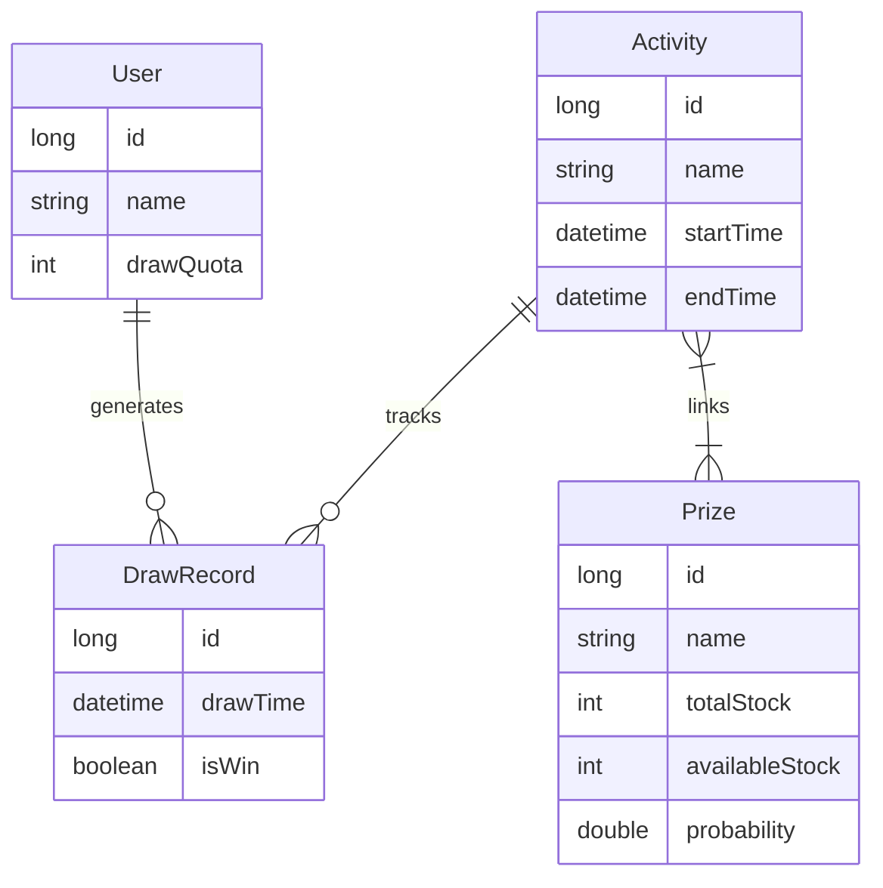
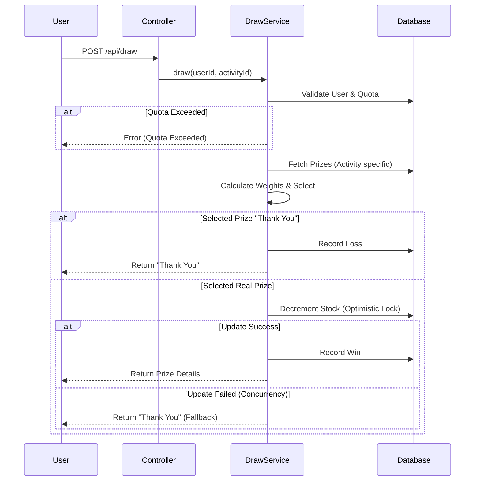

# Lucky Draw System

A high-concurrency "Wheel of Fortune" style lucky draw system built with Java 21 and Spring Boot 3.3.0.

## Features
- **Prize Configuration**: Dynamic probability, stock control, and "Thank You" entries.
- **Concurrency Safety**: Prevents over-selling using Optimistic Locking (DB).
- **User Limits**: Restricts draws per user per activity AND globally.
- **Fairness**: Weighted Random Algorithm for probability distribution.
- **Localization**: Fully localized to Traditional Chinese (Taiwan).
- **Risk Control**: Global user draw quotas and activity-specific limits.

## Architecture

### Tech Stack
- **Language**: Java 21
- **Framework**: Spring Boot 3.3.0
- **Database**: H2 (Dev) / MySQL/PostgreSQL (Prod ready via config)
- **Docs**: Swagger/OpenAPI (Springdoc)

### Stock Control Strategy
1.  **Check Stock**: Filter prizes with `availableStock > 0`.
2.  **Select Prize**: Use weighted random algorithm.
3.  **Decrement Stock**: Uses DB Optimistic Locking to ensure atomicity.
    ```sql
    UPDATE prizes 
    SET available_stock = available_stock - 1 
    WHERE id = :id AND available_stock > 0
    ```
4.  **Java Implementation**:
    ```java
    // Service Layer
    int updatedRows = prizeRepository.decrementStock(selectedPrize.getId());
    if (updatedRows > 0) {
        // Stock secured, record win
    } else {
        // Stock exhausted concurrently, fallback to "Empty/Thank You" prize
        selectedPrize = getFallbackPrize();
    }
    ```

### Core Logic & Validation

#### 1. Probability Cascade Adjustment
When a major prize's probability is updated, the system automatically maintains the 100% total rule:
1. Calculate `Sum(Other Prizes) + New Probability`.
2. Validation: If `Sum > 1.0`, reject update.
3. **Cascade Effect**: Automatically update the **"Thank You" (Empty)** prize probability:
   ```java
   // AdminServiceImpl.java
   double newThankYouProb = 1.0 - totalWithoutThankYou;
   thankYouPrize.setProbability(newThankYouProb);
   ```

#### 2. Stock Consistency
- **Initialization**: `availableStock` defaults to `totalStock` on creation.
- **Updates**: When `totalStock` changes, `availableStock` is adjusted by the delta to preserve consumption state:
  ```java
  int diff = prizeDetails.getTotalStock() - prize.getTotalStock();
  if (diff != 0) {
      prize.setAvailableStock(prize.getAvailableStock() + diff);
  }
  ```

## Database Schema

### ER Model


## Draw Process Flow


## API Documentation

Access Swagger UI at `http://localhost:8080/swagger-ui.html` for full interactive documentation.

### Authentication & Role-Based Access Control
The system implements a simple token-based authentication mechanism with role segregation.

**Header**: `Authorization: Bearer <token>`

| Role  | Token Value | Access Scope |
| :--- | :--- | :--- |
| **Admin** | `admin-secret` | Full Access (Create Activities, Manage Prizes, **Create Users**) |
| **User** | `<any-other-token>` | Read-only access to user data, Draw API |

> [!IMPORTANT]
> The **User Creation** API (`POST /api/users`) is protected and requires **Admin** privileges (`Bearer admin-secret`).

### 1. Admin - Create User
- **POST** `/api/users`
- **Auth**: `Bearer admin-secret`
- **Body**:
```json
{
  "name": "Test User",
  "drawQuota": 50
}
```

### 2. Admin - Create Prize (Standalone)
- **POST** `/api/admin/prizes`
- **Body**:
```json
{
  "name": "iPhone 15",
  "totalStock": 10,
  "probability": 0.01
}
```

### 2. Admin - Create Activity
- **POST** `/api/admin/activities`
- **Body**:
```json
{
  "name": "New Year Event",
  "startTime": "2024-12-01T10:00:00+08:00",
  "endTime": "2024-12-31T23:59:59+08:00",
  "maxDrawsPerUser": 5,
  "prizeIds": [1, 2, 3] 
}
```
*Note: `prizeIds` links existing prizes to the activity.*

### 3. User - Draw
- **POST** `/api/draw`
- **Body**:
```json
{
  "userId": 1,
  "activityId": 1,
  "count": 1
}
```

### 4. Admin - Query Draw Records
- **GET** `/api/admin/draw-records?activityId=1&isWin=true`

## Testing
Run unit and integration tests:
```bash
mvn test
```
